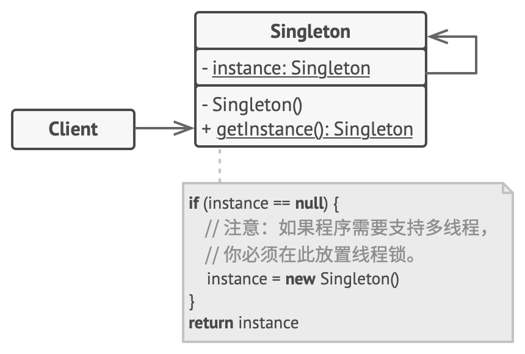

# 定义

保证一个类只有一个实例， 并提供一个访问该实例的全局节点

## 优点

✅ 可以保证一个类只有一个实例（全局唯一实例，避免重复创建）
✅ 为该实例提供一个全局访问节点（唯一访问方式）
✅ （懒加载）仅在首次请求单例对象时对其进行初始化

## 缺点

❌ 单例模式同时解决了两个问题， 所以违反了单一职责原则

1. 保证一个类只有一个实例
2. 为该实例提供一个全局访问节点（唯一方式）

 
 
 

# 应用场景

- 每个应用实例唯一的单例化状态容器 Pinia / Vuex / Redux
- 登入弹窗组件
- 日志 / 埋点
